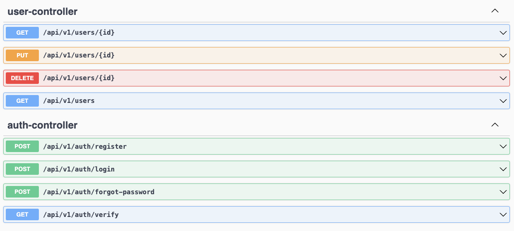
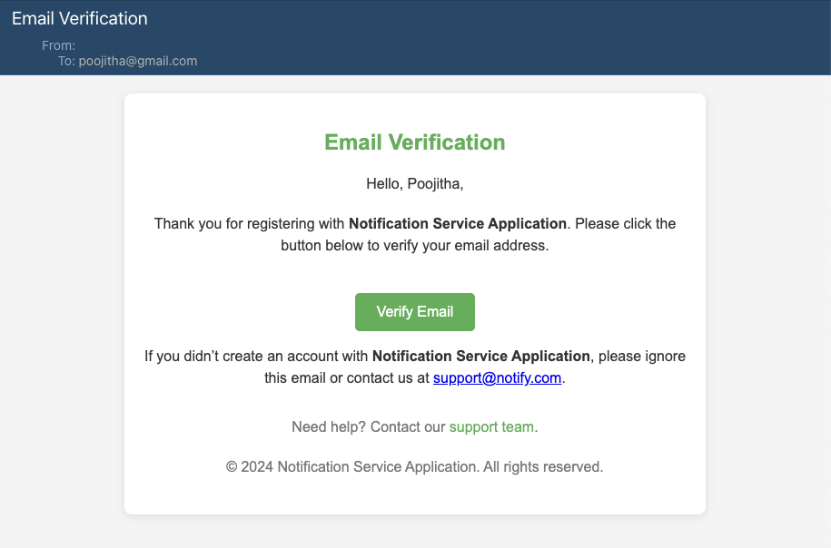
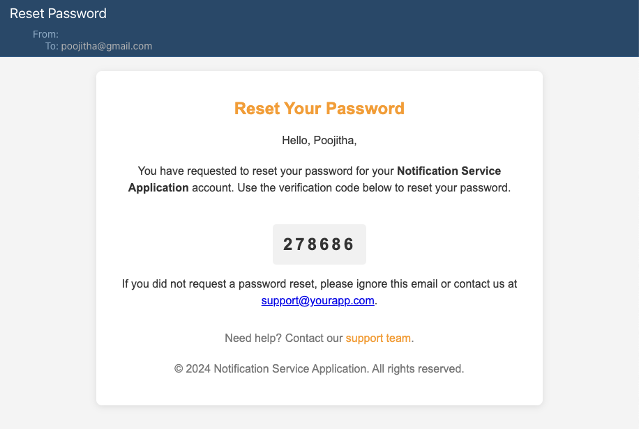
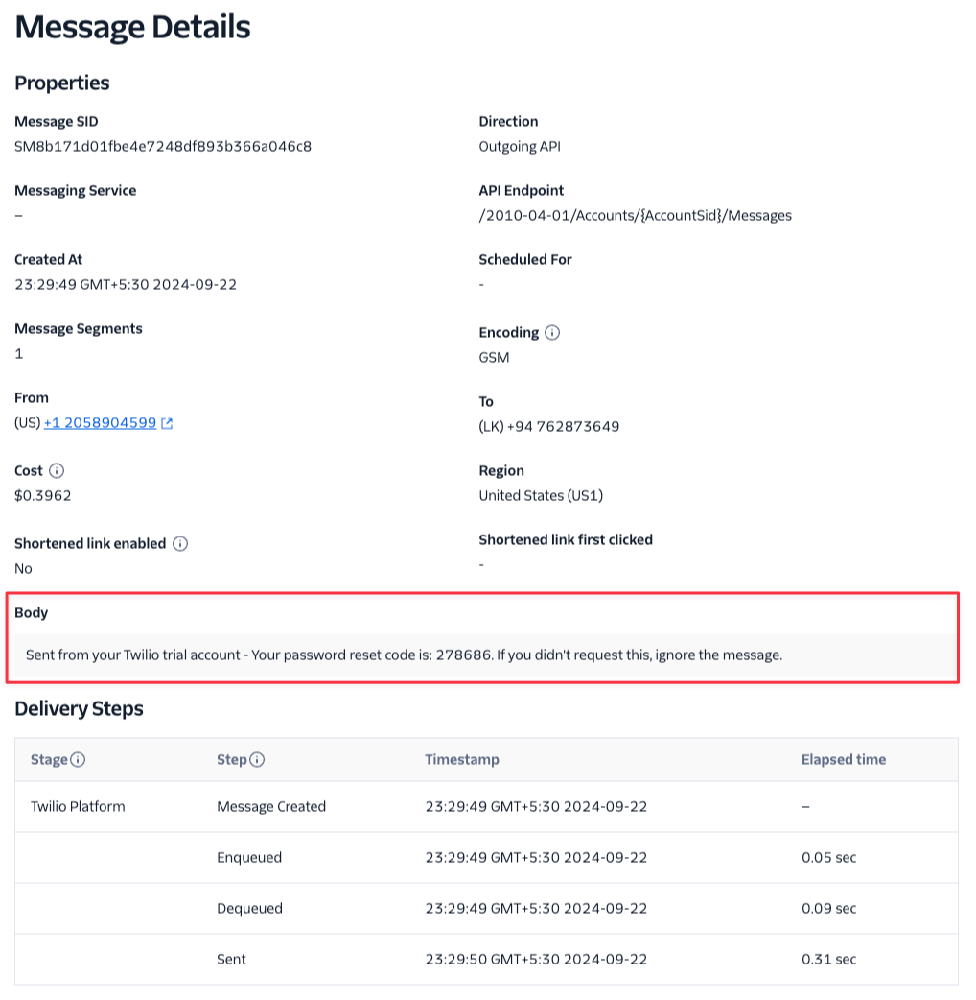
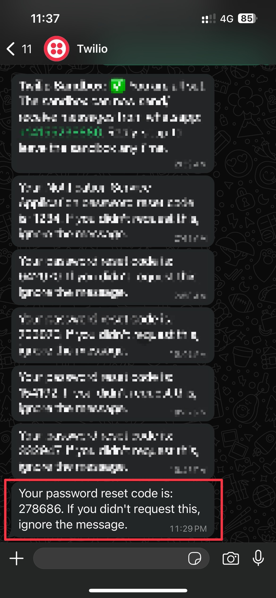

# Spring Boot Notification Service

This Spring Boot application provides a robust notification system capable of sending **emails, SMS, and WhatsApp
messages**. It also includes functionalities for email verification and password reset, demonstrating how to integrate
the
notification service into your applications.

## Features:

- Multiple Notification Channels: Send notifications via **email, SMS, and WhatsApp**.
- Email Verification: Implement email verification flows in your applications.
- Password Reset: Send password reset notifications with secure links.
- Secure Configuration: Leverage environment variables or a dedicated configuration file (e.g., application.yml) to
  store sensitive credentials.
- Docker Support: Easily deploy and run the service using Docker Compose.

## Getting Started

### Prerequisites:

- Java 17 - Spring Boot 3
- Maven or Gradle (build tool)
- Docker (optional, for easier deployment)

1. **Clone the Repository**

    ```Bash
    git clone https://github.com/PoojithaIrosha/notification-service.git
    cd notification-service
    ```

2. **Configure Notifications**

    - **Email**: If using a dedicated email service provider, update the necessary configurations in application.yml or
      use environment variables. Refer to your email provider's documentation for specific configuration details.
        ```YAML
        spring:
          mail:
            host: smtp.hostname.com
            port: 587
            username: <your-email>
            password: <your-password>
            properties:
              mail:
                smtp:
                  auth: true
                  starttls:
                    enable: true
        ```

    - **SMS & WhatsApp**: Configure the Twilio credentials in application.yml or using environment variables. You can
      sign
      up for a free Twilio account to obtain the necessary credentials.

        ```YAML
        twilio:
          account-sid: <your-account-sid>
          auth-token: <your-auth-token>
          phone-number: <your-phone
        ```

3. **Run Docker Compose**

   To start the required services such as MailDev (for email testing), postgreSQL run the following command:
    ```Bash
    docker-compose up
    ```
4. **Run the Application**:

   After configuring Twilio and starting Docker services, run the application:

    ```Bash
    mvn spring-boot:run
    ```
   Alternatively, you can build the project and run the jar file:

    ```Bash
    mvn clean package
    java -jar target/spring-notification-service.jar
    ```

### Application Access

- Swagger UI: Access the API documentation at http://localhost:8090/swagger-ui.html.
- Mail Dev Server (Optional): If you're using a local mail server for development, the port may differ. Check your mail
  server configuration for the correct port (default is usually 1025).

## Example Use Cases

This project supports multiple notification channels: Email, SMS, and WhatsApp.

1. **Email Verification**:

   Integrate the notification service into your application to send email verification messages containing a unique
   token or link.

    - Upon user registration, send a notification email with the verification link.
    - Verify the user's email address by processing the token or clicking the link.


2. **Password Reset**:

   Implement a password reset flow in your application.

    - Generate a secure random password or allow users to choose a new one.
    - Send a notification **EMAIL / SMS /WHATSAPP MSG** containing the temporary password or a link to reset the
      password.
    - Allow users to update their password using the temporary password or the provided link.

## API Endpoints



## Sample Notifications

1. **Email Verification Mail Sample**



2. **Reset Passsword Mail Sample**



3. **SMS Notification Sample**



4. **WhatsApp Notification Sample**



## Technologies Used

- Spring Boot
- Twilio API for SMS and WhatsApp notifications
- MailDev for local email testing
- Swagger UI for API documentation
- Docker Compose for containerized services

## Contributing

Contributions are welcome! Feel free to open issues or submit pull requests to improve the project.

## License

This project is licensed under the MIT License. See the [LICENSE](LICENSE) file for details.